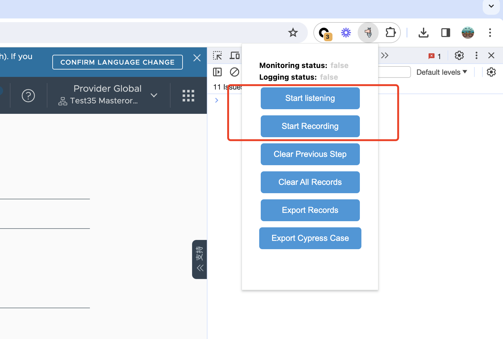
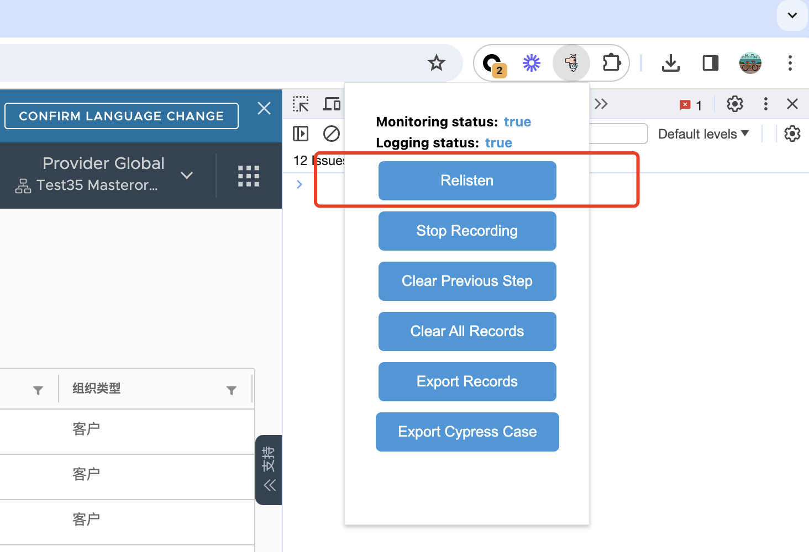

### Run

```
git clone git@gitlab.eng.vmware.com:g11n/automation/g11n-integration/cypress/action-tracker.git
cd action-tracker
npm install
npm run build
```

### Install


Open Chrome -> Manage extensions -> Load unpacked > Select action-tracker

### Use
Before using, make sure that both the monitoring status and the logging status are turned on, please click Start Listening and Start Recording to start page monitoring and recording. It should be noted that as long as `the page changes` or `the page refreshes`, please manually click `Resliten` button again, all listeners of the page will be re-registered, avoid page changes that plug-ins don't know about   

The automatic listening function is not yet perfect, so this version of the plugin requires users to listen manually



Features:
* Stop Recording -> Set logging status is false
* Clear Previous Step -> Clear the operation record of the previous step
* Clear All Records -> Clear all operation records
* Export Records -> The export operation is recorded as a json file
* Export Cypress Case -> Convert the operation log to Cypress code and generate a file