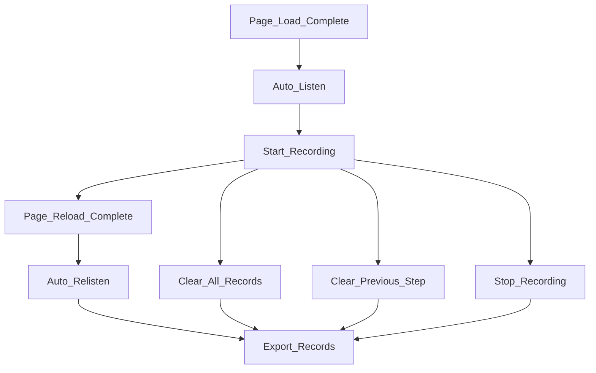

This is an extension designed to log all actions on the page. You can run npm run build to give it a try.

> Note: The extension will automatically re-listen to the page every 1.5 seconds.

### record sample

```json
{
   "1699427005959-type":{
      "isEnter":false,
      "value":"a@aaa.com",
      "xPath":"id(\"discovery_username\")"
   },
   "1699427009794-click":{
      "content":"",
      "xPath":"id(\"next-btn\")"
   },
   "1699427142607-click":{
      "content":"客户管理",
      "xPath":"/html[1]/body[1]/cp-root[1]/clr-main-container[1]/div[1]/div[1]/cp-nav[1]/clr-vertical-nav[1]/div[1]/div[3]/a[1]/span[1]"
   },
   "1699427174471-click":{
      "content":"添加客户",
      "xPath":"/cp-customer-datagrid[1]/div[1]/button[1]"
   },
   "1699427193241-check":{
      "isChecked":true,
      "type":"radio",
      "value":"INTERNAL",
      "xPath":"id(\"clr-form-control-23\")"
   },
   "1699427217107-type":{
      "isEnter":false,
      "value":"vmware",
      "xPath":"id(\"clr-form-control-15\")"
   },
   "1699427231301-click":{
      "content":"取消",
      "xPath":"/cp-customer-form[1]/div[1]/div[1]/button[1]"
   },
   "1699427661108-click":{
      "content":"配置器",
      "xPath":"/html[1]/body[1]/cp-root[1]/clr-main-container[1]/div[1]/div[1]/cp-nav[1]/clr-vertical-nav[1]/div[1]/div[4]/a[1]/span[1]"
   },
   "1699427720784-click":{
      "content":"保存的配置",
      "xPath":"id(\"msp-saved-config-nav\")"
   },
   "1699427723727-click":{
      "content":"新建配置",
      "xPath":"id(\"clr-tab-link-1\")"
   },
   "1699427724810-click":{
      "content":"保存的配置",
      "xPath":"id(\"msp-saved-config-nav\")"
   }
}
```

### Features

* ~~Listen: Start listening mode (deprecated)~~
* ~~Relisten: Restart listening mode (deprecated)~~
* Stop And Start Recording
* Clear Previous Step
* Clear All Records
* Export Records

### Lifecycle




### Todo

- [ ] Support for more page operations
- [x] Optimize the popup page with UI
- [ ] Support for turning operations into cypress cases
- [x] Auto relisten

