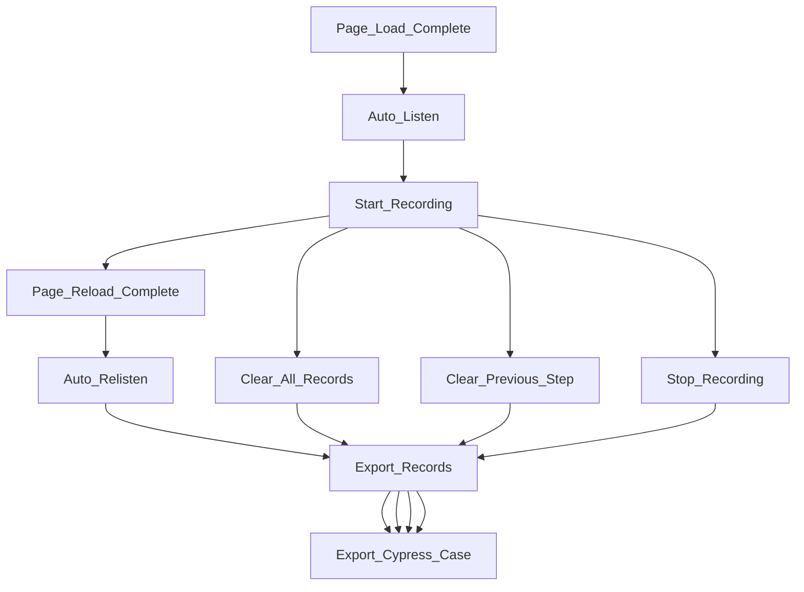

This is an extension designed to log all actions on the page. You can run npm run build to give it a try.

> Note: ~~The extension will automatically re-listen to the page every 1.5 seconds.~~, automatically re-listen is being repaired，The current mode requires you to manually re-click Listen after the page changes

### record sample

```json
{
   "1700011247590-click":{
      "content":"Sign in using another account",
      "id":"",
      "xPath":"/html[1]/body[1]/div[3]/div[1]/form[1]/div[1]/div[1]/div[1]/div[4]/label[1]/a[1]"
   },
   "1700011277855-type":{
      "id":"discovery_username",
      "isEnter":false,
      "value":"username",
      "xPath":"id(\"discovery_username\")"
   },
   "1700011280230-click":{
      "content":"",
      "id":"next-btn",
      "xPath":"id(\"next-btn\")"
   },
   "1700011299521-type":{
      "id":"password",
      "isEnter":false,
      "value":"password",
      "xPath":"id(\"password\")"
   },
   "1700011303964-click":{
      "content":"SIGN IN",
      "id":"",
      "xPath":"/html[1]/body[1]/app-root[1]/div[1]/div[1]/div[1]/div[1]/app-enter-password-page[1]/div[1]/form[1]/div[1]/button[1]"
   },
   "1700011378588-click":{
      "content":"Kundenverwaltung",
      "id":"",
      "xPath":"/html[1]/body[1]/cp-root[1]/clr-main-container[1]/div[1]/div[1]/cp-nav[1]/clr-vertical-nav[1]/div[1]/div[3]/a[1]/span[1]"
   },
   "1700011389653-click":{
      "content":"akhils-tenant_2023-11-10_1828",
      "id":"cm-name-7644069d-73d9-4c40-adc4-5aef8e8d9dd6",
      "xPath":"id(\"cm-name-7644069d-73d9-4c40-adc4-5aef8e8d9dd6\")"
   },
   "1700011399170-select":{
      "content":"50",
      "id":"clr-id-49",
      "value":"2: 50",
      "xPath":"id(\"clr-id-49\")"
   }
}
```

### Cypress Sample
```javascript
describe('template spec', () => {
  it('passes', () => {
    cy.contains('Sign in using another account').click();
    cy.get('#discovery_username').type('username');
    cy.get('#next-btn').click();
    cy.get('#password').type('password');
    cy.contains('SIGN IN').click();
    cy.contains('Kundenverwaltung').click();
    cy.get('#cm-name-7644069d-73d9-4c40-adc4-5aef8e8d9dd6').click();
    cy.get('#clr-id-49').select('50');
  })
})

```

### Features

* AutoListen: Developing
* Listen: Start listening mode
* Relisten: Restart listening mode
* Stop And Start Recording
* Clear Previous Step
* Clear All Records
* Export Records
* Export Cypress Case

### Lifecycle




### Todo

- [ ] Support for more page operations
- [x] Support for turning operations into cypress cases
- [ ] Auto relisten

